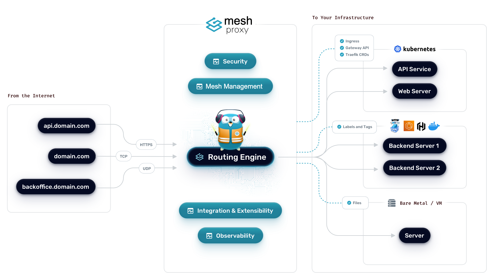

# What is Mesh?

Mesh is an [open-source](https://github.com/Mesh/Mesh) *Application Proxy* that makes publishing your services a fun and easy experience. 
It receives requests on behalf of your system, identifies which components are responsible for handling them, and routes them securely. 

What sets Mesh apart, besides its many features, is that it automatically discovers the right configuration for your services. 
The magic happens when Mesh inspects your infrastructure, where it finds relevant information and discovers which service serves which request. 

Mesh is natively compliant with every major cluster technology, such as Kubernetes, Docker Swarm, AWS, and [the list goes on](./reference/install-configuration/providers/overview.md); and can handle many at the same time. (It even works for legacy software running on bare metal.)
 
With Mesh, there is no need to maintain and synchronize a separate configuration file: everything happens automatically, in real time (no restarts, no connection interruptions).
With Mesh, you spend time developing and deploying new features to your system, not on configuring and maintaining its working state.

And if your needs change, you can add API gateway and API management capabilities seamlessly to your existing Mesh deployments. It takes less than a minute, there’s no rip-and-replace, and all your configurations are preserved. See this in action in [our API gateway demo video](https://info.Mesh.io/watch-mesh-api-gw-demo?cta=docs).

!!! quote "From the Mesh Maintainer Team" 
    When developing Mesh, our main goal is to make it easy to use, and we're sure you'll enjoy it.

## Personas

Mesh supports different needs depending on your background. We keep three user personas in mind as we build and organize these docs:

- **Beginners**: You are new to Mesh or new to reverse proxies. You want simple, guided steps to set things up without diving too deep into advanced topics.
- **DevOps Engineers**: You manage infrastructure or clusters (Docker, Kubernetes, or other orchestrators). You integrate Mesh into your environment and value reliability, performance, and streamlined deployments.
- **Developers**: You create and deploy applications or APIs. You focus on how to expose your services through Mesh, apply routing rules, and integrate it with your development workflow.

## Core Concepts

Mesh’s main concepts help you understand how requests flow to your services:

- [Entrypoints](./reference/install-configuration/entrypoints.md) are the network entry points into Mesh. They define the port that will receive the packets and whether to listen for TCP or UDP.
- [Routers](./reference/routing-configuration/http/router/rules-and-priority.md) are in charge of connecting incoming requests to the services that can handle them. In the process, routers may use pieces of [middleware](./reference/routing-configuration/http/middlewares/overview.md) to update the request or act before forwarding the request to the service.
- [Services](./reference/routing-configuration/http/load-balancing/service.md) are responsible for configuring how to reach the actual services that will eventually handle the incoming requests.
- [Providers](./reference/install-configuration/providers/overview.md) are infrastructure components, whether orchestrators, container engines, cloud providers, or key-value stores. The idea is that Mesh queries the provider APIs in order to find relevant information about routing, and when Mesh detects a change, it dynamically updates the routes.

These concepts work together to manage your traffic from the moment a request arrives until it reaches your application.

## How to Use the Documentation

- **Navigation**: Each main section focuses on a specific stage of working with Mesh - installing, exposing services, observing, extending & migrating. 
Use the sidebar to navigate to the section that is most appropriate for your needs.
- **Practical Examples**: You will see code snippets and configuration examples for different environments (YAML/TOML, Labels, & Tags).
- **Reference**: When you need to look up technical details, our reference section provides a deep dive into configuration options and key terms.

!!! info

    Have a question? Join our [Community Forum](https://community.Mesh.io "Link to Mesh Community Forum") to discuss, learn, and connect with the Mesh community.

    Using Mesh OSS in Production? Consider our enterprise-grade [API Gateway](https://info.Mesh.io/watch-mesh-api-gw-demo?cta=doc) or our [24/7/365 OSS Support](https://info.Mesh.io/request-commercial-support?cta=doc).

    Explore our API Gateway upgrade via [this short demo video](https://info.Mesh.io/watch-mesh-api-gw-demo?cta=doc).
